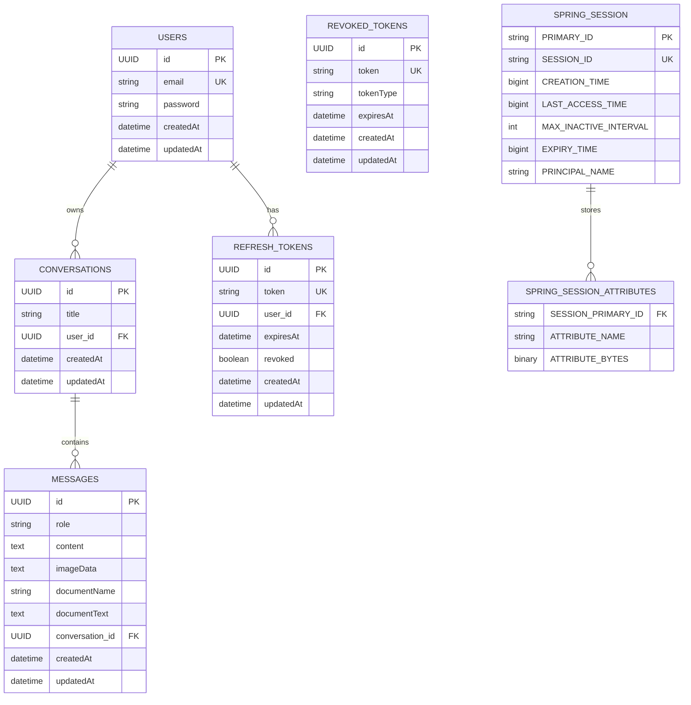

# AI Chatbot

- [Frontend Project](https://github.com/JeralSandeeptha/genai-chatbot-frontend)
- [Backend Project](https://github.com/JeralSandeeptha/genai-chatbot-backend)

---

```mermaid
erDiagram
    USERS {
        UUID id PK
        string email UK
        string password
        datetime createdAt
        datetime updatedAt
    }

    CONVERSATIONS {
        UUID id PK
        string title
        UUID user_id FK
        datetime createdAt
        datetime updatedAt
    }

    MESSAGES {
        UUID id PK
        string role
        text content
        text imageData
        string documentName
        text documentText
        UUID conversation_id FK
        datetime createdAt
        datetime updatedAt
    }

    REFRESH_TOKENS {
        UUID id PK
        string token UK
        UUID user_id FK
        datetime expiresAt
        boolean revoked
        datetime createdAt
        datetime updatedAt
    }

    REVOKED_TOKENS {
        UUID id PK
        string token UK
        string tokenType
        datetime expiresAt
        datetime createdAt
        datetime updatedAt
    }

    SPRING_SESSION {
        string PRIMARY_ID PK
        string SESSION_ID UK
        bigint CREATION_TIME
        bigint LAST_ACCESS_TIME
        int MAX_INACTIVE_INTERVAL
        bigint EXPIRY_TIME
        string PRINCIPAL_NAME
    }

    SPRING_SESSION_ATTRIBUTES {
        string SESSION_PRIMARY_ID FK
        string ATTRIBUTE_NAME
        binary ATTRIBUTE_BYTES
    }

    USERS ||--o{ CONVERSATIONS : owns
    CONVERSATIONS ||--o{ MESSAGES : contains
    USERS ||--o{ REFRESH_TOKENS : has
    SPRING_SESSION ||--o{ SPRING_SESSION_ATTRIBUTES : stores
```
