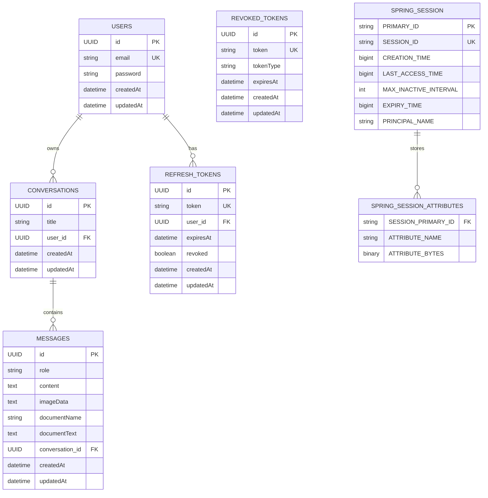
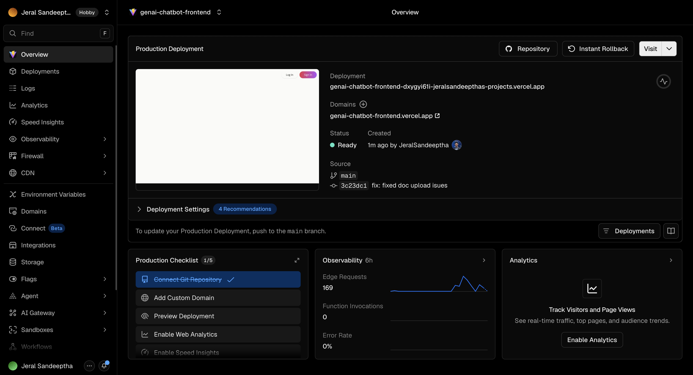
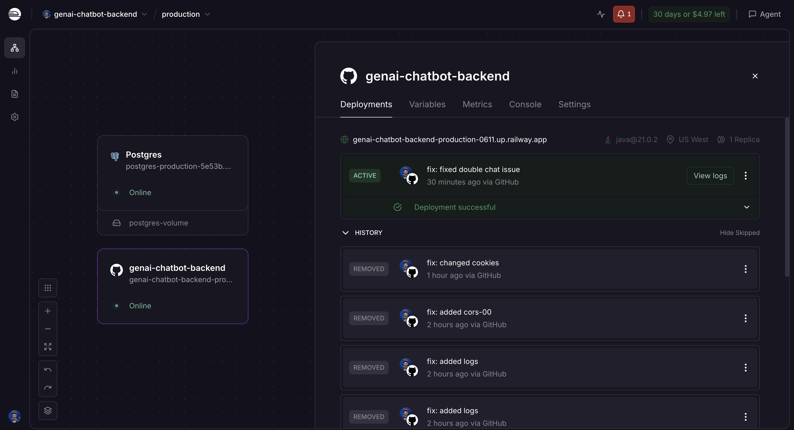

# AI Chatbot

## Table of Contents

- [Links](#links)
- [Projects](#projects)
- [Database Design](#database-design)
- [Deployments](#deployments)
- [API Documentation](#api-documentation)
- [Setup Instructions](#setup-instructions)
- [Architecture Decisions](#architecture-decisions)
- [Security](#security)
- [Limitations](#limitations)

## Links

- https://genai-chatbot-frontend.vercel.app/
- https://genai-chatbot-backend-production-0611.up.railway.app/

## Projects

- [Frontend Project](https://github.com/JeralSandeeptha/genai-chatbot-frontend)
- [Backend Project](https://github.com/JeralSandeeptha/genai-chatbot-backend)

## Database Design

---



## Deployments




## API Documentation

Missing :)

## Setup Instructions

1. Clone Frontend Project

```git
git clone https://github.com/JeralSandeeptha/genai-chatbot-frontend.git
```

- Create a file called `.env.local` Add these envs in the root folder in frontend

```bash
VITE_API_URL=http://localhost:8080
VITE_DOMAIN=localhost
MODE=development
```

2. Clone Backend Project

```git
git clone https://github.com/JeralSandeeptha/genai-chatbot-backend.git
```

- Create `.env` file add envs in the root folder in backend

```bash
OPENAI_API_KEY=jasofjsaoidjasd.....
JWT_SECRET=thyaga-dev-secret-key-change-this-in-production-must-be-at-least-256-bits-long
```

3. Start postgres docker container if you are using as a database

```bash
docker compose up -d genai-postgres
```

- if you are using the remote database, use `application.properties` file (already added)

4. Run Projects

- Run backend project

```bash
use IDE to run project or just run the jar file
```

- Run frontend project

```cmd
npm run dev
```

## Architecture Decisions

1. Backend Architecture

`Layered Monolith`: Use a clean, single-module Spring Boot application split logically into Controller, Service, and Repository layers

`Security Context`: Implement JWTFilter to intercept incoming HTTP requests, extract the JWT token from the `Authorization: Bearer header`, validate it, and to make the user authentication

2. Frontend Architecture

`Vite + React Context API`: Bootstrapping with Vite ensures instant hot reloading. Use React's Context API to manage global auth state (JWT storage and user session data) to avoid the boilerplate of Redux or Zustand for an MVP

`Component-Driven Structure`: Separate layout wrappers (e.g., AuthLayout, DashboardLayout) from reusable UI elements (e.g., Spinner, Button, ChatBubble) (pp. 1, 3).

`Axios Interceptors`: Configure a global Axios instance that automatically attaches your stored JWT to every outgoing request and handles global 401 Unauthorized logouts uniformly.

3. AI & Data Integration

`Official SDK vs. HTTP Clients`: Utilize the official Spring AI framework or the provider's lightweight Java SDK (like OpenAI's official library) to streamline request serialization, token calculation, and timeout management.

`Synchronous Processing`: The assignment explicitly puts streaming, background jobs, and WebSockets out of scope. Process all AI queries via standard, synchronous REST calls with optimistic loading states on the client side

## Security

- For security I used `cookies` based `Access Token` and `Refresh Token` authentication.
- For API security just check the access tokens before access authenticated routes

## Limitations

- No Rate Limiting
- No Database Indexing
- No Query Optimizations
- No Caching Machanism
- No Event Queus
- I hardcoded some values in the `application.properties` file instead of adding envs (not all the env because of time limitations)
